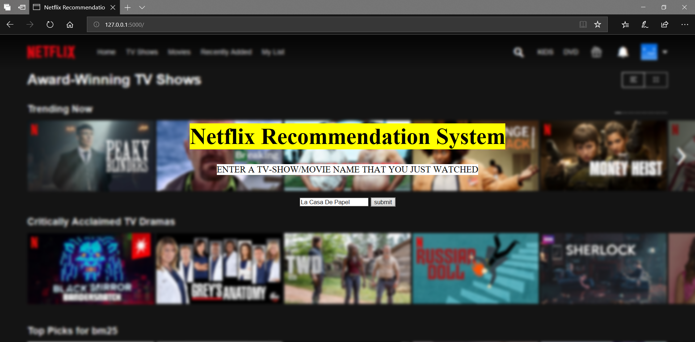

# Flask-Netflix-Recommendation-System
A flask web-app which can be used to get recommendations for a tv-show/movie, the app recommends a list of media according to the input.

# Screenshot 1 : Main Page 
Here the user can enter their movie of choice, for example I have entered La Casa De Papel a Spanish Netflix original show.

# Screenshot 2 : Recommendation Page 
Here the user will get recommendations, for example I recieved Elite(another spanish Netflix original) as my top recommendation 

Entire Explanation For This Program Is Attached Below :-
This code is a Python Flask application that provides movie recommendations based on a dataset of Netflix titles. Let's break down the functionality and structure of the code:

1. **Importing Libraries**:
   - `pandas`: Used for data manipulation and analysis.
   - `Flask`: Web framework used for creating the application.
   - `render_template`, `request`: Components of Flask for rendering HTML templates and handling HTTP requests.
   - `CountVectorizer` and `cosine_similarity` from `sklearn.feature_extraction.text` and `sklearn.metrics.pairwise`, respectively: Used for text vectorization and calculating cosine similarity between vectors.

2. **Data Cleaning Functions**:
   - `clean_data(x)`: A function to clean text data by converting it to lowercase and removing spaces.
   - `create_soup(x)`: Combines various features of the Netflix dataset into a single string soup, which will be used for vectorization.

3. **Recommendation Function**:
   - `get_recommendations(title, cosine_sim)`: This function takes a movie title and cosine similarity matrix as input, then calculates the similarity scores between the given movie and all other movies in the dataset. It returns the top 10 most similar movies.

4. **Loading and Preprocessing Data**:
   - The code reads in the Netflix dataset from a CSV file (`netflix_titles.csv`) using `pd.read_csv()`.
   - It selects relevant features (`title`, `director`, `cast`, `listed_in`, `description`) and fills any missing values with empty strings.
   - Data cleaning is performed on the selected features.
   - A 'soup' column is created by concatenating selected features to create a consolidated text for each movie.

5. **Vectorization and Similarity Calculation**:
   - `CountVectorizer` is used to convert text data into a matrix of token counts.
   - Cosine similarity is calculated between the vectors using `cosine_similarity`.

6. **Flask Application**:
   - An instance of the Flask class is created.
   - Two routes are defined:
     - `'/'`: Renders the `index.html` template.
     - `'/about'`: Handles POST requests, where the movie name is submitted.
       - Upon receiving the movie name, it calls `get_recommendations()` to get similar movies.
       - Renders the `result.html` template with the recommendation results.

7. **Running the Application**:
   - The `__name__` variable is checked to ensure that the script is being run directly.
   - The Flask application is run with `app.run()`.

Overall, this code creates a web-based movie recommendation system using Flask, where users can input a movie name, and the system will recommend similar movies based on cosine similarity of movie features.